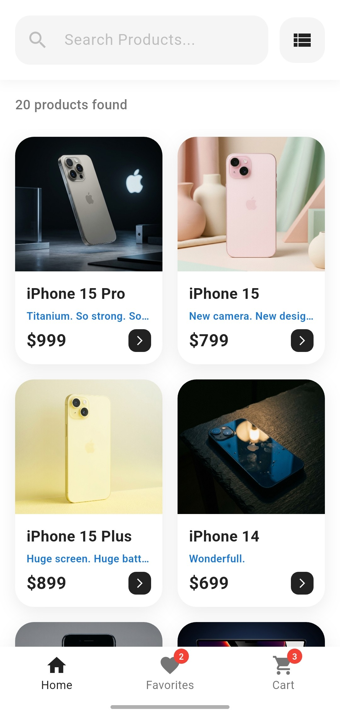
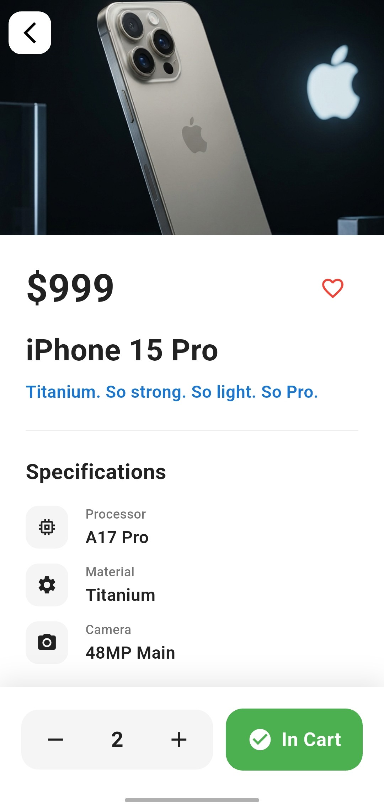
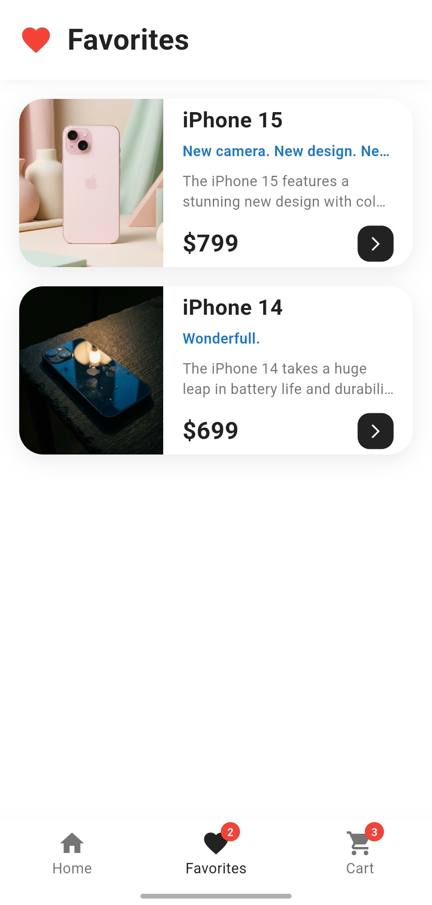
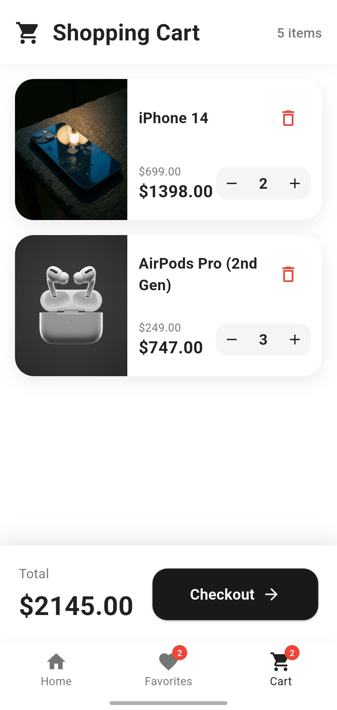

# 🛍️ Micato

A modern e-commerce mobile application built with Flutter.

## ✨ Features

- 📱 **Product Catalog**: Browse products in grid or list view
- 🔍 **Search & Filter**: Find products quickly
- ❤️ **Favorites**: Save your favorite items
- 🛒 **Shopping Cart**: Add items and manage quantities
- 📦 **Offline Support**: Static product data when API is unavailable
- 🎨 **Modern UI**: Clean and intuitive design
- ⚡ **Smooth Animations**: Page transitions and interactions

## 📸 Screenshots

| Home | Product Detail | Cart | Favorites |
|------|----------------|------|-----------|
|  |  |  |  |


## 🚀 Getting Started

### Prerequisites

- Flutter SDK (3.0 or higher)
- Dart SDK
- Android Studio / Xcode

### Installation

1. Clone the repository
```bash
git clone https://github.com/berkexterzi/micato.git
cd micato-shop
```

2. Install dependencies
```bash
flutter pub get
```

3. Run the app
```bash
flutter run
```

## 🏗️ Project Structure
```
lib/
├── models/          # Data models
├── services/        # API services
├── views/           # Screen widgets
├── components/      # Reusable widgets
└── main.dart        # App entry point
```

## 📦 Packages Used

- `http` - API requests
- Flutter Material Design

## 🔌 API

The app connects to a product API with fallback to static data when offline or on timeout.

🔗 API Endpoint: https://wantapi.com/products.php

## 📝 License

This project is open source.

## 👨‍💻 Author

- **Berke Terzi** – [GitHub Profile](https://github.com/berkexterzi)
- **Berke Terzi** – [LinkedIn Profile](https://www.linkedin.com/in/berke-terzi)

## 🤝 Contributing

Contributions, issues, and feature requests are welcome!

---

Made with Flutter
